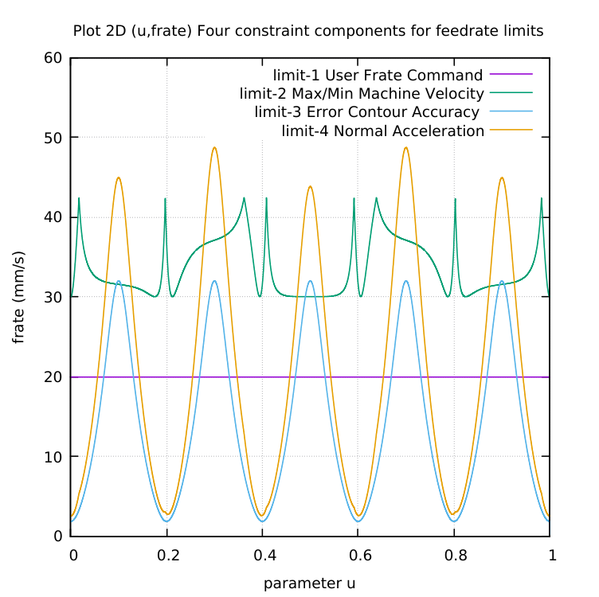
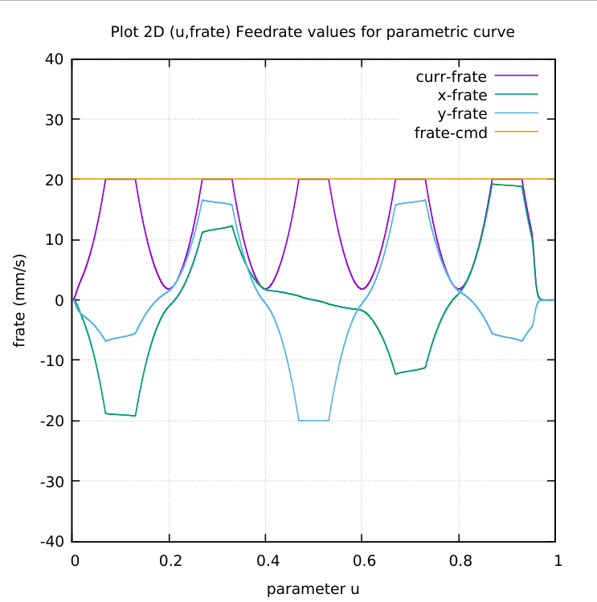

# HYPOTROCOID-parametric-curve
HYPOTROCOID C-codes to generate NGC for CNC milling

# The four(4) contributions to the Feedrate Limit

# Current feedrate = minimum of feedrate limits

Wassalam.
WRY
